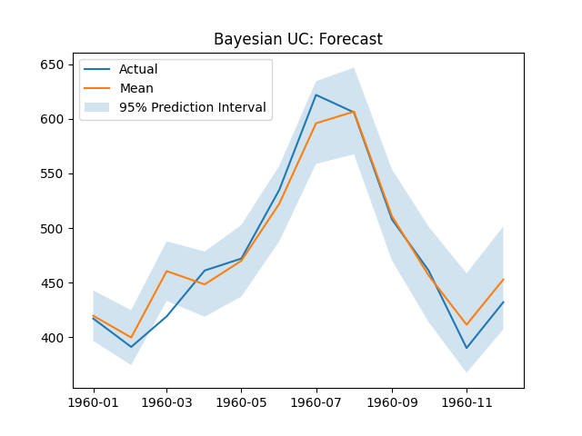
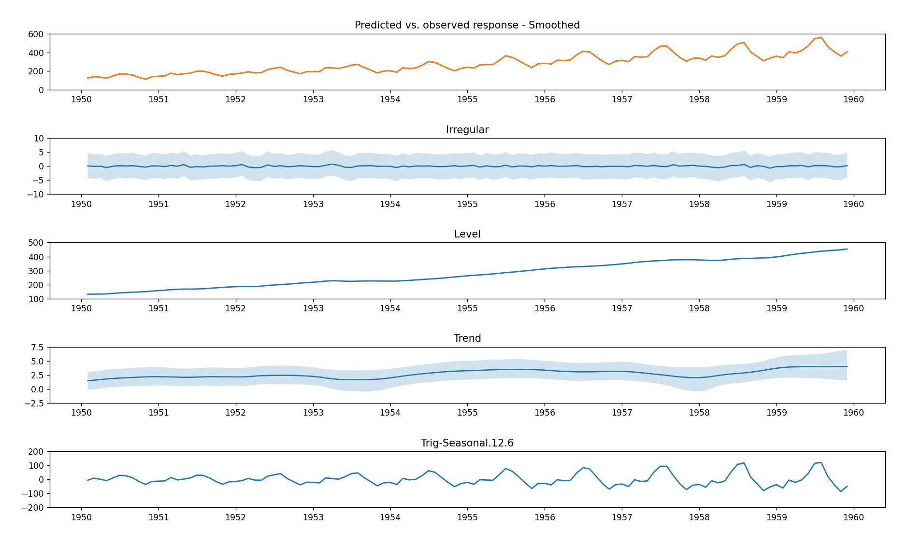
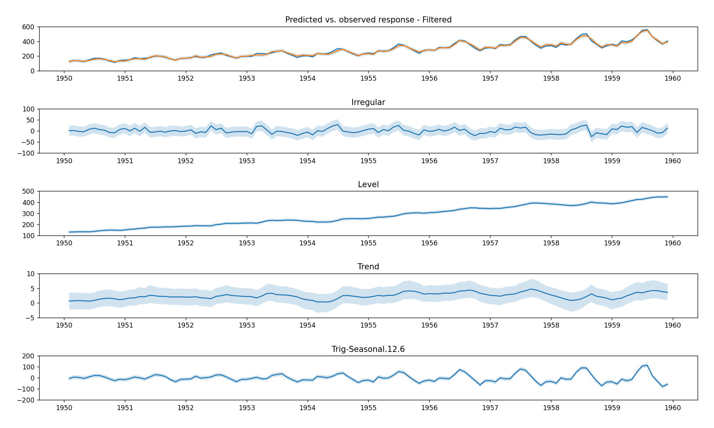
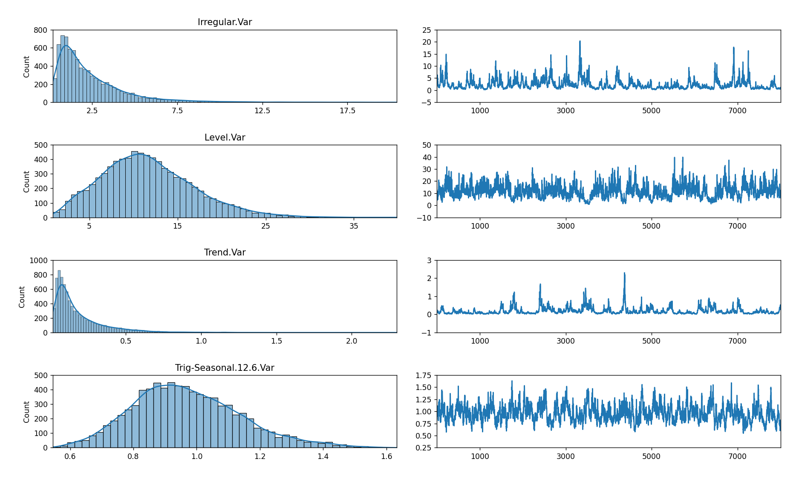

# pybuc
`pybuc` (Python Bayesian Unobserved Components) is a version of R's Bayesian structural time 
series package, `bsts`, written by Steven L. Scott. The source paper can be found 
[here](https://people.ischool.berkeley.edu/~hal/Papers/2013/pred-present-with-bsts.pdf) or in the *papers* 
directory of this repository. While there are plans to expand the feature set of `pybuc`, currently there is no roadmap 
for the release of new features. The syntax for using `pybuc` closely follows `statsmodels`' `UnobservedComponents` 
module.

The current version of `pybuc` includes the following options for modeling and 
forecasting a structural time series: 

- Stochastic or non-stochastic level
- Damped level
- Stochastic or non-stochastic trend
- Damped trend <sup/>*</sup>
- Multiple stochastic or non-stochastic periodic-lag seasonality
- Multiple damped periodic-lag seasonality
- Multiple stochastic or non-stochastic "dummy" seasonality
- Multiple stochastic or non-stochastic trigonometric seasonality
- Regression with static coefficients<sup/>**</sup>

<sup/>*</sup> `pybuc` dampens trend differently than `bsts`. The former assumes an AR(1) process **without** 
drift for the trend state equation. The latter assumes an AR(1) **with** drift. In practice this means that the trend, 
on average, will be zero with `pybuc`, whereas `bsts` allows for the mean trend to be non-zero. The reason for 
choosing an autoregressive process without drift is to be conservative with long horizon forecasts.

<sup/>**</sup> `pybuc` estimates regression coefficients differently than `bsts`. The former uses a standard Gaussian 
prior. The latter uses a Bernoulli-Gaussian mixture commonly known as the spike-and-slab prior. The main 
benefit of using a spike-and-slab prior is its promotion of coefficient-sparse solutions, i.e., variable selection, when 
the number of predictors in the regression component exceeds the number of observed data points.

Fast computation is achieved using [Numba](https://numba.pydata.org/), a high performance just-in-time (JIT) compiler 
for Python.

# Installation
```
pip install pybuc
```
See `pyproject.toml` and `poetry.lock` for dependency details. This module depends on NumPy, Numba, Pandas, and 
Matplotlib. Python 3.9 and above is supported.

# Motivation

The Seasonal Autoregressive Integrated Moving Average (SARIMA) model is perhaps the most widely used class of 
statistical time series models. By design, these models can only operate on covariance-stationary time series. 
Consequently, if a time series exhibits non-stationarity (e.g., trend and/or seasonality), then the data first have to 
be stationarized. Transforming a non-stationary series to a stationary one usually requires taking local and/or seasonal 
time-differences of the data, but sometimes a linear trend to detrend a trend-stationary series is sufficient. 
Whether to stationarize the data and to what extent differencing is needed are things that need to be determined 
beforehand.

Once a stationary series is in hand, a SARIMA specification must be identified. Identifying the "right" SARIMA 
specification can be achieved algorithmically (e.g., see the Python package `pmdarima`) or through examination of a 
series' patterns. The latter typically involves statistical tests and visual inspection of a series' autocorrelation 
(ACF) and partial autocorrelation (PACF) functions. Ultimately, the necessary condition for stationarity requires 
statistical analysis before a model can be formulated. It also implies that the underlying trend and seasonality, if 
they exist, are eliminated in the process of generating a stationary series. Consequently, the underlying time 
components that characterize a series are not of empirical interest.

Another less commonly used class of model is structural time series (STS), also known as unobserved components (UC). 
Whereas SARIMA models abstract away from an explicit model for trend and seasonality, STS/UC models do not. Thus, it is 
possible to visualize the underlying components that characterize a time series using STS/UC. Moreover, it is relatively 
straightforward to test for phenomena like level shifts, also known as structural breaks, by statistical examination of 
a time series' estimated level component.

STS/UC models also have the flexibility to accommodate multiple stochastic seasonalities. SARIMA models, in contrast, 
can accommodate multiple seasonalities, but only one seasonality/periodicity can be treated as stochastic. For example, 
daily data may have day-of-week and week-of-year seasonality. Under a SARIMA model, only one of these seasonalities can 
be modeled as stochastic. The other seasonality will have to be modeled as deterministic, which amounts to creating and 
using a set of predictors that capture said seasonality. STS/UC models, on the other hand, can accommodate both 
seasonalities as stochastic by treating each as distinct, unobserved state variables.

With the above in mind, what follows is a comparison between `statsmodels`' `SARIMAX'` module, `statsmodels`' 
`UnobservedComponents` module, and `pybuc`. The distinction between `statsmodels.UnobservedComponents` and `pybuc` is 
the former is a maximum likelihood estimator (MLE) while the latter is a Bayesian estimator. The following code 
demonstrates the application of these methods on a data set that exhibits trend and multiplicative seasonality.
The STS/UC specification for `statsmodels.UnobservedComponents` and `pybuc` includes stochastic level, stochastic trend 
(trend), and stochastic trigonometric seasonality with periodicity 12 and 6 harmonics.

# Usage

## Example: univariate time series with level, trend, and multiplicative seasonality

A canonical data set that exhibits trend and seasonality is the airline passenger data used in
Box, G.E.P.; Jenkins, G.M.; and Reinsel, G.C. Time Series Analysis, Forecasting and Control. Series G, 1976. See plot 
below.


This data set gave rise to what is known as the "airline model", which is a SARIMA model with first-order local and 
seasonal differencing and first-order local and seasonal moving average representations. 
More compactly, SARIMA(0, 1, 1)(0, 1, 1) without drift.

To demonstrate the performance of the "airline model" on the airline passenger data, the data will be split into a 
training and test set. The former will include all observations up until the last twelve months of data, and the latter 
will include the last twelve months of data. See code below for model assessment.

### Import libraries and prepare data

```
from pybuc import buc
import numpy as np
import pandas as pd
import matplotlib.pyplot as plt
from statsmodels.tsa.statespace.sarimax import SARIMAX
from statsmodels.tsa.statespace.structural import UnobservedComponents


# Convenience function for computing root mean squared error
def rmse(actual, prediction):
    act, pred = actual.flatten(), prediction.flatten()
    return np.sqrt(np.mean((act - pred) ** 2))


# Import airline passenger data
url = "https://raw.githubusercontent.com/devindg/pybuc/master/examples/data/airline-passengers.csv"
air = pd.read_csv(url, header=0, index_col=0)
air = air.astype(float)
air.index = pd.to_datetime(air.index)
hold_out_size = 12

# Create train and test sets
y_train = air.iloc[:-hold_out_size]
y_test = air.iloc[-hold_out_size:]
```

### SARIMA

```
''' Fit the airline data using SARIMA(0,1,1)(0,1,1) '''
sarima = SARIMAX(y_train, order=(0, 1, 1),
                 seasonal_order=(0, 1, 1, 12),
                 trend=[0])
sarima_res = sarima.fit(disp=False)
print(sarima_res.summary())

# Plot in-sample fit against actuals
plt.plot(y_train)
plt.plot(sarima_res.fittedvalues)
plt.title('SARIMA: In-sample')
plt.xticks(rotation=45, ha="right")
plt.show()

# Get and plot forecast
sarima_forecast = sarima_res.get_forecast(hold_out_size).summary_frame(alpha=0.05)
plt.plot(y_test)
plt.plot(sarima_forecast['mean'])
plt.fill_between(sarima_forecast.index,
                 sarima_forecast['mean_ci_lower'],
                 sarima_forecast['mean_ci_upper'], alpha=0.2)
plt.title('SARIMA: Forecast')
plt.legend(['Actual', 'Mean', '95% Prediction Interval'])
plt.show()

# Print RMSE
print(f"SARIMA RMSE: {rmse(y_test.to_numpy(), sarima_forecast['mean'].to_numpy())}")
```

```
SARIMA RMSE: 21.09028021383853
```

The SARIMA(0, 1, 1)(0, 1, 1) forecast plot.


### MLE Unobserved Components

```
''' Fit the airline data using MLE unobserved components '''
mle_uc = UnobservedComponents(y_train, exog=None, irregular=True,
                              level=True, stochastic_level=True,
                              trend=True, stochastic_trend=True,
                              freq_seasonal=[{'period': 12, 'harmonics': 6}],
                              stochastic_freq_seasonal=[True])

# Fit the model via maximum likelihood
mle_uc_res = mle_uc.fit(disp=False)
print(mle_uc_res.summary())

# Plot in-sample fit against actuals
plt.plot(y_train)
plt.plot(mle_uc_res.fittedvalues)
plt.title('MLE UC: In-sample')
plt.show()

# Plot time series components
mle_uc_res.plot_components(legend_loc='lower right', figsize=(15, 9), which='smoothed')
plt.show()

# Get and plot forecast
mle_uc_forecast = mle_uc_res.get_forecast(hold_out_size).summary_frame(alpha=0.05)
plt.plot(y_test)
plt.plot(mle_uc_forecast['mean'])
plt.fill_between(mle_uc_forecast.index,
                 mle_uc_forecast['mean_ci_lower'],
                 mle_uc_forecast['mean_ci_upper'], alpha=0.2)
plt.title('MLE UC: Forecast')
plt.legend(['Actual', 'Mean', '95% Prediction Interval'])
plt.show()

# Print RMSE
print(f"MLE UC RMSE: {rmse(y_test.to_numpy(), mle_uc_forecast['mean'].to_numpy())}")
```

```
MLE UC RMSE: 17.961873327622694
```

The MLE Unobserved Components forecast and component plots.


As noted above, a distinguishing feature of STS/UC models is their explicit modeling of trend and seasonality. This is 
illustrated with the components plot.

Finally, the Bayesian analog of the MLE STS/UC model is demonstrated. Default parameter values are used for the priors 
corresponding to the variance parameters in the model. See below for default priors on variance parameters.

**Note that because computation is built on Numba, a JIT compiler, the first run of the code could take a while. 
Subsequent runs (assuming the Python kernel isn't restarted) should execute considerably faster.**

### Bayesian Unobserved Components
```
''' Fit the airline data using Bayesian unobserved components '''
bayes_uc = buc.BayesianUnobservedComponents(response=y_train,
                                            level=True, stochastic_level=True,
                                            trend=True, stochastic_trend=True,
                                            trig_seasonal=((12, 0),), stochastic_trig_seasonal=(True,),
                                            seed=123)
post = bayes_uc.sample(5000)
mcmc_burn = 100

# Print summary of estimated parameters
for key, value in bayes_uc.summary(burn=mcmc_burn).items():
    print(key, ' : ', value)

# Plot in-sample fit against actuals
yhat = np.mean(post.filtered_prediction[mcmc_burn:], axis=0)
plt.plot(y_train)
plt.plot(y_train.index, yhat)
plt.title('Bayesian-UC: In-sample')
plt.show()

# Plot time series components
bayes_uc.plot_components(burn=mcmc_burn, smoothed=True)
plt.show()

# Plot trace of posterior
bayes_uc.plot_trace(burn=mcmc_burn)
plt.show()

# Get and plot forecast
forecast, _ = bayes_uc.forecast(hold_out_size, mcmc_burn)
forecast_mean = np.mean(forecast, axis=0)
forecast_l95 = np.quantile(forecast, 0.025, axis=0).flatten()
forecast_u95 = np.quantile(forecast, 0.975, axis=0).flatten()

plt.plot(y_test)
plt.plot(bayes_uc.future_time_index, forecast_mean)
plt.fill_between(bayes_uc.future_time_index, forecast_l95, forecast_u95, alpha=0.2)
plt.title('Bayesian UC: Forecast')
plt.legend(['Actual', 'Mean', '95% Prediction Interval'])
plt.show()

# Print RMSE
print(f"BAYES-UC RMSE: {rmse(y_test.to_numpy(), forecast_mean)}")
```

```
BAYES-UC RMSE: 16.686702600845987
```

The Bayesian Unobserved Components forecast plot, components plot, and RMSE are shown below.



#### Component plots

##### Smoothed



##### Filtered



#### Trace plots



# Model

A structural time series model with level, trend, seasonal, and regression components takes the form: 

$$
y_t = \mu_t + \boldsymbol{\gamma}^\prime _t \mathbb{1}_p + \mathbf x_t^\prime \boldsymbol{\beta} + \epsilon_t
$$ 

where $\mu_t$ specifies an unobserved dynamic level component, $\boldsymbol{\gamma}_ t$ is a $p \times 1$ vector of 
unobserved dynamic seasonal components that represent unique periodicities, $\mathbf x_t^\prime \boldsymbol{\beta}$ a 
partially unobserved regression component (the regressors $\mathbf x_t$ are observed, but the coefficients 
$\boldsymbol{\beta}$ are not), and $\epsilon_t \sim N(0, \sigma_{\epsilon}^2)$ an unobserved irregular component. The 
equation describing the outcome $y_t$ is commonly referred to as the observation equation, and the transition equations 
governing the evolution of the unobserved states are known as the state equations.

## Level and trend

The unobserved level evolves according to the following general transition equations:

$$
\begin{align}
    \mu_{t+1} &= \kappa \mu_t + \delta_t + \eta_{\mu, t} \\ 
    \delta_{t+1} &= \phi \delta_t + \eta_{\delta, t} 
\end{align}
$$ 

where $\eta_{\mu, t} \sim N(0, \sigma_{\eta_\mu}^2)$ and $\eta_{\delta, t} \sim N(0, \sigma_{\eta_\delta}^2)$ for all 
$t$. The state equation for $\delta_t$ represents the local trend at time $t$. 

The parameters $\kappa$ and $\phi$ represent autoregressive coefficients. In general, $\kappa$ and $\phi$ are expected 
to be in the interval $(-1, 1)$, which implies a stationary process. In practice, however, it is possible for either 
$\kappa$ or $\phi$ to be outside the unit circle, which implies an explosive process. While it is mathematically 
possible for an explosive process to be stationary, the implication of such a result implies that the future predicts 
the past, which is not a realistic assumption. If an autoregressive level or trend is specified, no hard constraints 
(by default) are placed on the bounds of the autoregressive parameters. Instead, the default prior for these parameters 
is vague (see section on priors below).

Note that if $\sigma_{\eta_\mu}^2 = \sigma_{\eta_\delta}^2 = 0$ and $\phi = 1$ and $\kappa = 1$, then the level 
component in the observation equation, $\mu_t$, collapses to a deterministic intercept and linear time trend.

## Seasonality

### Periodic-lag form
For a given periodicity $S$, a seasonal component in $\boldsymbol{\gamma}_t$, $\gamma^S_t$, can be modeled in three 
ways. One way is based on periodic lags. Formally, the seasonal effect on $y$ is modeled as

$$
\gamma^S_t = \rho(S) \gamma^S_{t-S} + \eta_{\gamma^S, t},
$$

where $S$ is the number of periods in a seasonal cycle, $\rho(S)$ is an autoregressive parameter expected to lie in the 
unit circle (-1, 1), and $\eta_{\gamma^S, t} \sim N(0, \sigma_{\eta_\gamma^S}^2)$ for all $t$. If damping is not 
specified for a given periodic lag, $\rho(S) = 1$ and seasonality is treated as a random walk process.

This specification for seasonality is arguably the most robust representation (relative to dummy and trigonometric) 
because its structural assumption on periodicity is the least complex.

### Dummy form
Another way is known as the "dummy" variable approach. Formally, the seasonal effect on the outcome $y$ is modeled as 

$$
\sum_{j=0}^{S-1} \gamma^S_{t-j} = \eta_{\gamma^S, t} \iff \gamma^S_t = -\sum_{j=1}^{S-1} \gamma^S_{t-j} + \eta_{\gamma^S, t},
$$ 

where $j$ indexes the number of periods in a seasonal cycle, and $\eta_{\gamma^S, t} \sim N(0, \sigma_{\eta_\gamma^S}^2)$ 
for all $t$. Intuitively, if a time series exhibits periodicity, then the sum of the periodic effects over a cycle 
should, on average, be zero.

### Trigonometric form
The final way to model seasonality is through a trigonometric representation, which exploits the periodicity of sine and 
cosine functions. Specifically, seasonality is modeled as

$$
\gamma^S_t = \sum_{j=1}^h \gamma^S_{j, t}
$$

where $j$ indexes the number of harmonics to represent seasonality of periodicity $S$ and 
$1 \leq h \leq \lfloor S/2 \rfloor$ is the highest desired number of harmonics. The state transition equations for each 
harmonic, $\gamma^S_{j, t}$, are represented by a real and imaginary part, specifically

$$
\begin{align}
    \gamma^S_ {j, t+1} &= \cos(\lambda_j) \gamma^S_{j, t} + \sin(\lambda_j) \gamma^{S*}_ {j, t} + \eta_{\gamma^S_ j, t} \\
    \gamma^{S*}_ {j, t+1} &= -\sin(\lambda_j) \gamma^S_ {j, t} + \cos(\lambda_j) \gamma^{S*}_ {j, t} + \eta_{\gamma^{S*}_ j , t}
\end{align}
$$

where frequency $\lambda_j = 2j\pi / S$. It is assumed that $\eta_{\gamma^S_j, t}$ and $\eta_{\gamma^{S*}_ j , t}$ are 
distributed $N(0, \sigma^2_{\eta^S_\gamma})$ for all $j, t$. Note that when $S$ is even, $\gamma^{S*}_ {S/2, t+1}$ is not 
needed since 

$$
\begin{align}
    \gamma^S_{S/2, t+1} &= \cos(\pi) \gamma^S_{S/2, t} + \sin(\pi) \gamma^{S*}_ {S/2, t} + \eta_{\gamma^S_{S/2}, t} \\
    &= (-1) \gamma^S_{S/2, t} + (0) \gamma^{S*}_ {S/2, t} + \eta_{\gamma^S_{S/2}, t} \\
    &= -\gamma^S_{S/2, t} + \eta_{\gamma^S_{S/2}, t}
\end{align}
$$
 
Accordingly, if $S$ is even and $h = S/2$, then there will be $S - 1$ state equations. More generally, the number of 
state equations for a trigonometric specification is $2h$, except when $S$ is even and $h = S/2$.

## Regression
There are two ways to configure the model matrices to account for a regression component with static coefficients. 
The canonical way (Method 1) is to append $\mathbf x_t^\prime$ to $\mathbf Z_t$ and $\boldsymbol{\beta}_t$ to the 
state vector, $\boldsymbol{\alpha}_t$ (see state space representation below), with the constraints 
$\boldsymbol{\beta}_0 = \boldsymbol{\beta}$ and $\boldsymbol{\beta}_t = \boldsymbol{\beta} _{t-1}$ for all $t$. 
Another, less common way (Method 2) is to append $\mathbf x_t^\prime \boldsymbol{\beta}$ to $\mathbf Z_t$ and 1 to the 
state vector. 

While both methods can be accommodated by the Kalman filter, Method 1 is a direct extension of the Kalman filter as it 
maintains the observability of $\mathbf Z_t$ and treats the regression coefficients as unobserved states. Method 2 does 
not fit naturally into the conventional framework of the Kalman filter, but it offers the significant advantage of only 
increasing the size of the state vector by one. In contrast, Method 1 increases the size of the state vector by the size 
of $\boldsymbol{\beta}$. This is significant because computational complexity is quadratic in the size of the state 
vector but linear in the size of the observation vector.

The unobservability of $\mathbf Z_t$ under Method 2 can be handled with maximum likelihood or Bayesian estimation by 
working with the adjusted series 

$$
y_t^* \equiv y_t - \tau_t = \mathbf x_ t^\prime \boldsymbol{\beta} + \epsilon_t
$$

where $\tau_t$ represents the time series component of the structural time series model. For example, assuming a level 
and seasonal component are specified, this means an initial estimate of the time series component 
$\tau_t = \mu_t + \boldsymbol{\gamma}^\prime_ t \mathbb{1}_p$ and $\boldsymbol{\beta}$ has to be acquired first. Then 
$\boldsymbol{\beta}$ can be estimated conditional on $\mathbf y^ * \equiv \left(y_1^ *, y_2^ *, \cdots, y_n^ *\right)^\prime$.

`pybuc` uses Method 2 for estimating static coefficients.

## Default priors

### Irregular and state variances

If no priors are given for variances corresponding to stochastic states (i.e., level, trend, and seasonality), 
the following defaults are used:

$$
\begin{align}
    \sigma^2_{\mathrm{level}} &\sim \mathrm{IG}(0.01, (0.01 * \mathrm{Std.Dev}(y))^2) \\
    \sigma^2_{\mathrm{seasonal}} &\sim \mathrm{IG}(0.01, (10 * 0.01 * \mathrm{Std.Dev}(y))^2) \\
    \sigma^2_{\mathrm{trend}} &\sim \mathrm{IG}(0.01, (0.1 * 0.01 * \mathrm{Std.Dev}(y))^2) \\
\end{align}
$$

The level prior matches the default level prior in R's `bsts` package. However, the default seasonal and trend priors
are different. While the default trend prior in `bsts` is the same as the level and seasonal priors, `pybuc` makes a 
more conservative assumption about the variance associated with trend. This is reflected by a standard deviation 
that is one-tenth (one-hundredth) the magnitude of the level (seasonal) standard deviation. In other words, 
this prior assumes that variation in trend is small relative to variation in level and seasonality. The objective is to 
mitigate the impact that noise in the data could have on producing an overly aggressive trend.

In a similar vein, the default seasonal prior is different from `bsts`'s in that it allows for more flexibility in scale. 
Specifically, the seasonal standard deviation is ten (one-hundred) times larger than the standard deviation for level 
(trend). Intuitively, changes from one cycle to another, as opposed to one period to the next, are likely to be larger.

The default prior for irregular variance is:

$$
\sigma^2_{\mathrm{irregular}} \sim \mathrm{IG}(0.01, (0.01 * \mathrm{Std.Dev}(y))^2)
$$

### Damped/autoregressive state coefficients

Damping can be applied to level, trend, and periodic-lag seasonality state components. By default, if no prior is given 
for an autoregressive (i.e., AR(1)) coefficient, the prior takes the form 

$$
\phi \sim N(1, 1)
$$

where $\phi$ represents some autoregressive coefficient. Thus, the prior encodes the belief that the process (level, 
trend, seasonality) is a random walk. A unit variance is assumed to accommodate different types of dynamics, including 
stationary or explosive processes that may oscillate, grow, or decay.


### Regression coefficients

The default prior for regression coefficients is

$$
\boldsymbol{\beta} \sim N\left(\mathbf 0, \frac{\kappa}{n} \left(\frac{1}{2} \mathbf X^\prime \mathbf X + \frac{1}{2} \mathrm{diag}(\mathbf X^\prime \mathbf X \right)\right)
$$

where $\mathbf X$ is the design matrix, $n$ is the number of response observations, and $\kappa = 0.000001$ is the number 
of default prior observations given to the mean prior of $\mathbf 0$. This prior is a slight modification of Zellner's 
g-prior (to guard against potential singularity of the design matrix). The number of prior observations, $\kappa$, can be 
changed by passing a value to the argument `zellner_prior_obs` in the `sample()` method. If Zellner's g-prior is not 
desired, then a custom precision matrix can be passed to the argument `reg_coeff_prec_prior`. Similarly, if a zero-mean 
prior is not wanted, a custom mean prior can be passed to `reg_coeff_mean_prior`.

## State space representation (example)
The unobserved components model can be rewritten in state space form. For example, suppose level, trend, seasonal, 
regression, and irregular components are specified, and the seasonal component takes a trigonometric form with 
periodicity $S=4$ and $h=2$ harmonics. Let $\mathbf Z_t \in \mathbb{R}^{1 \times m}$, 
$\mathbf T \in \mathbb{R}^{m \times m}$, $\mathbf R \in \mathbb{R}^{m \times q}$, and 
$\boldsymbol{\alpha}_ t \in \mathbb{R}^{m \times 1}$ denote the observation matrix, state transition matrix, 
state error transformation matrix, and unobserved state vector, respectively, where $m$ is the number of state equations 
and $q$ is the number of state parameters to be estimated (i.e., the number of stochastic state equations, 
which is defined by the number of positive state variance parameters). 

There are $m = 1 + 1 + (h * 2 - 1) + 1 = 6$ state equations and $q = 1 + 1 + (h * 2 - 1) = 5$ stochastic state equations
, where the term $(h * 2 - 1)$ follows from $S=4$ being even and $h = S/2$. Outside of this case, there would generally 
be $h * 2$ state equations for trigonometric seasonality. Note also that there are 5 stochastic state equations because 
the state value for the regression component is not stochastic; it is 1 for all $t$ by construction. The observation, 
state transition, and state error transformation matrices may be 
written as

$$
\begin{align}
    \mathbf Z_t &= \left(\begin{array}{cc} 
                        1 & 0 & 1 & 0 & 1 & \mathbf x_t^{\prime} \boldsymbol{\beta}
                        \end{array}\right) \\
    \mathbf T &= \left(\begin{array}{cc} 
                        1 & 1 & 0 & 0 & 0 & 0 \\
                        0 & 1 & 0 & 0 & 0 & 0 \\
                        0 & 0 & \cos(2\pi / 4) & \sin(2\pi / 4) & 0 & 0 \\
                        0 & 0 & -\sin(2\pi / 4) & \cos(2\pi / 4) & 0 & 0 \\
                        0 & 0 & 0 & 0 & -1 & 0 \\
                        0 & 0 & 0 & 0 & 0 & 1
                        \end{array}\right) \\
    \mathbf R &= \left(\begin{array}{cc} 
                    1 & 0 & 0 & 0 & 0 \\
                    0 & 1 & 0 & 0 & 0 \\
                    0 & 0 & 1 & 0 & 0 \\
                    0 & 0 & 0 & 1 & 0 \\
                    0 & 0 & 0 & 0 & 1 \\
                    0 & 0 & 0 & 0 & 0
                    \end{array}\right)
\end{align}
$$

Given the definitions of $\mathbf Z_t$, $\mathbf T$, and $\mathbf R$, the state space representation of the unobserved 
components model above can compactly be expressed as

$$
\begin{align}
    y_t &= \mathbf Z_t \boldsymbol{\alpha}_ t + \epsilon_t \\
    \boldsymbol{\alpha}_ {t+1} &= \mathbf T \boldsymbol{\alpha}_ t + \mathbf R \boldsymbol{\eta}_ t, \hspace{5pt} 
    t=1,2,...,n
\end{align}
$$

where

$$
\begin{align}
    \boldsymbol{\alpha}_ t &= \left(\begin{array}{cc} 
                            \mu_t & \delta_t & \gamma^4_{1, t} & \gamma^{4*}_ {1, t} & \gamma^4_{2, t} & 1
                            \end{array}\right)^\prime \\
    \boldsymbol{\eta}_ t &= \left(\begin{array}{cc} 
                            \eta_{\mu, t} & \eta_{\delta, t} & \eta_{\gamma^4_ 1, t} & \eta_{\gamma^{4*}_ 1, t} & 
                            \eta_{\gamma^4_ 2, t}
                            \end{array}\right)^\prime
\end{align}
$$

and 

$$
\mathrm{Cov}(\boldsymbol{\eta}_ t) = \mathrm{Cov}(\boldsymbol{\eta}_ {t-1}) = \boldsymbol{\Sigma}_ \eta = 
\mathrm{diag}(\sigma^2_{\eta_\mu}, \sigma^2_{\eta_\delta}, \sigma^2_{\eta_{\gamma^4_ 1}}, \sigma^2_{\eta_{\gamma^{4*}_ 1}}, 
\sigma^2_{\eta_{\gamma^4_ 2}}) \in \mathbb{R}^{5 \times 5} \hspace{5pt} \textrm{for all } t=1,2,...,n
$$

# Estimation
`pybuc` mirrors R's `bsts` with respect to estimation method. The observation vector, state vector, and regression 
coefficients are assumed to be conditionally normal random variables, and the error variances are assumed to be 
conditionally independent inverse-Gamma random variables. These model assumptions imply conditional conjugacy of the 
model's parameters. Consequently, a Gibbs sampler is used to sample from each parameter's posterior distribution.

To achieve fast sampling, `pybuc` follows `bsts`'s adoption of the Durbin and Koopman (2002) simulation smoother. For 
any parameter $\theta$, let $\theta(s)$ denote the $s$-th sample of parameter $\theta$. Each sample $s$ is drawn by 
repeating the following three steps:

1. Draw $\boldsymbol{\alpha}(s)$ from 
   $p(\boldsymbol{\alpha} | \mathbf y, \boldsymbol{\sigma}^2_\eta(s-1), \boldsymbol{\beta}(s-1), \sigma^2_\epsilon(s-1))$ 
   using the Durbin and Koopman simulation state smoother, where 
   $\boldsymbol{\alpha}(s) = (\boldsymbol{\alpha}_ 1(s), \boldsymbol{\alpha}_ 2(s), \cdots, \boldsymbol{\alpha}_ n(s))^\prime$ 
   and $\boldsymbol{\sigma}^2_\eta(s-1) = \mathrm{diag}(\boldsymbol{\Sigma}_\eta(s-1))$. Note that `pybuc` implements a 
   correction (based on a potential misunderstanding) for drawing $\boldsymbol{\alpha}(s)$ per "A note on implementing 
   the Durbin and Koopman simulation smoother" (Marek Jarocinski, 2015).
2. Draw $\boldsymbol{\sigma}^2(s) = (\sigma^2_ \epsilon(s), \boldsymbol{\sigma}^2_ \eta(s))^\prime$ from 
   $p(\boldsymbol{\sigma}^2 | \mathbf y, \boldsymbol{\alpha}(s), \boldsymbol{\beta}(s-1))$ using Durbin and Koopman's 
   simulation disturbance smoother.
3. Draw $\boldsymbol{\beta}(s)$ from 
   $p(\boldsymbol{\beta} | \mathbf y^ *, \boldsymbol{\alpha}(s), \sigma^2_\epsilon(s))$, where $\mathbf y^ *$ is defined 
   above.

By assumption, the elements in $\boldsymbol{\sigma}^2(s)$ are conditionally independent inverse-Gamma distributed random 
variables. Thus, Step 2 amounts to sampling each element in $\boldsymbol{\sigma}^2(s)$ independently from their 
posterior inverse-Gamma distributions.
